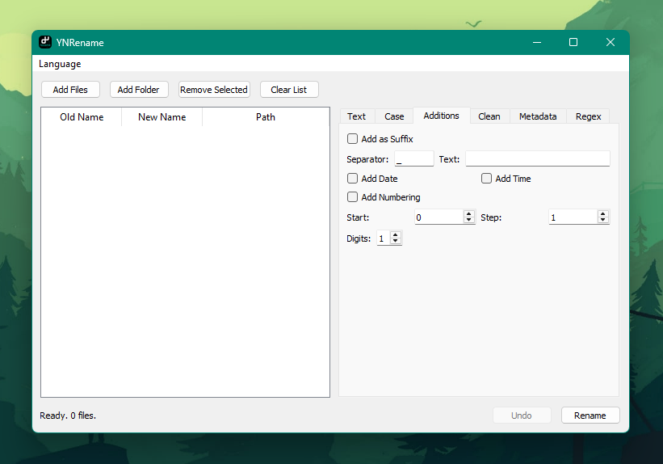
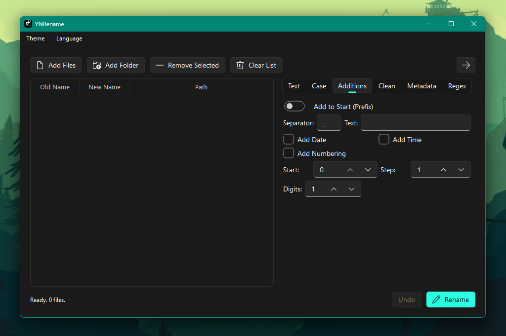

# YNRename

A powerful and versatile bulk file renaming tool built with PyQt5 and PyQt-Fluent-Widgets.





## What it does

YNRename is a multi-functional utility designed to rename large batches of files quickly and efficiently. It offers a wide range of renaming rules—from simple find-and-replace to advanced metadata-based formatting and regular expressions. With its real-time preview and undo functionality, you can rename your files with confidence.

## Requirements

- Python 3.10 or later
- PyQt5
- pyqt-fluent-widgets (for the Fluent UI version)
- mutagen (optional, for metadata-based renaming)

```
pip install PyQt5 pyqt-fluent-widgets mutagen
```

## Running

```
python main.py
```

On Windows, `win.py` is recommended instead. It uses PyQt-Fluent-Widgets for a native Windows 11 look with automatic theme and accent color detection.

```
python win.py
```

## Features

- **Batch Renaming**: Process hundreds of files in a single click.
- **Multiple Renaming Modes**:
    - **Text**: Search and replace strings with optional case sensitivity and regex support.
    - **Case**: Change filename case (lowercase, UPPERCASE, Title Case, camelCase, snake_case, kebab-case).
    - **Additions**: Add prefixes, suffixes, separators, custom text, current date/time, or sequential numbering.
    - **Clean**: Convert Turkish characters to ASCII, replace spaces with underscores, remove OS-illegal characters, and trim characters from start/end or between markers.
    - **Metadata**: Rename files using internal tags (e.g., `{artist}`, `{title}`, `{album}`, `{year}`, `{size}`, `{date}`) extracted from the files.
    - **Regex**: Full regular expression support for complex pattern matching and replacement.
- **Real-time Preview**: See exactly what the new filenames will look like before applying changes.
- **Undo Support**: Easily revert the last renaming operation if needed.
- **Drag & Drop**: Import files and folders simply by dragging them into the window.
- **Modern UI (`win.py`)**: Native Windows 11 Fluent design with automatic system theme (Light/Dark) and accent color detection.
- **Multilingual Support**: Available in Turkish, English, French, Spanish, Italian, and Russian.

## Notes

- `mutagen` is required for reading music metadata (tags like `{artist}`, `{title}`, etc.). Without it, only system tags like `{size}` and `{date}` will work.
- The `win.py` version requires `pyqt-fluent-widgets` to be installed.
- Always check the preview column before clicking "Rename" to ensure the results are as expected.
